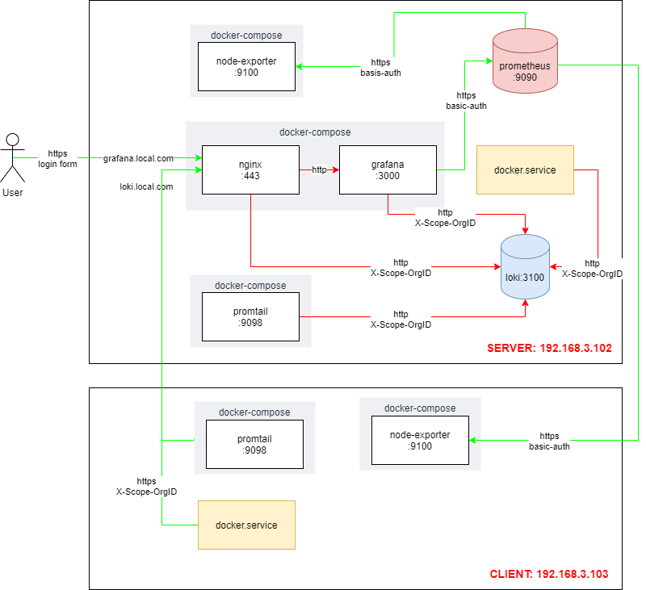
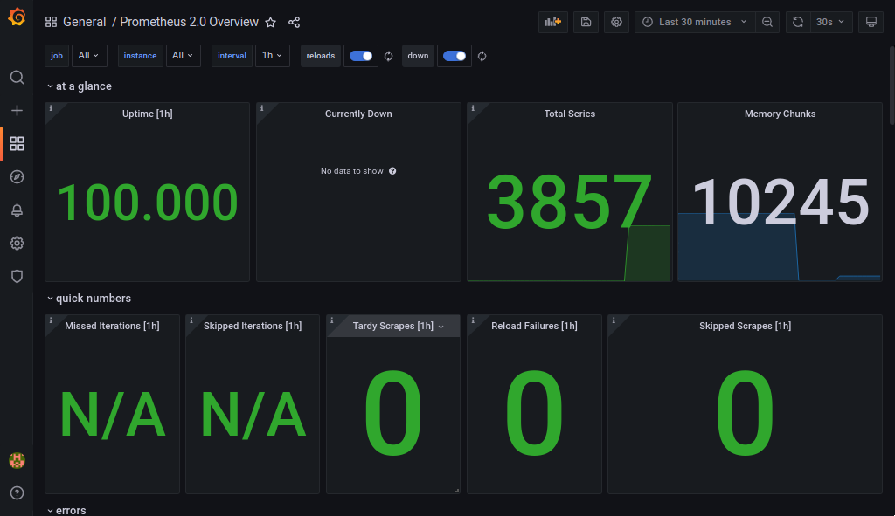

# Purpose

This lab will setup a Linux monitoring system using Ansible. It uses Prometheus + node-exporter to monitor server peformance (CPU, memory, disk, network, ...) and Loki + Promtail to monitor server logs (ssh, systemd, docker, auditd, ...)



I tested scripts on my own computer but there maybe still have some bugs. Please notify me at tuanndd@gmail.com if there is a new bug.

# Guideline
## 1. Run vagrant hosts
```bash
# download Ubuntu 20.04 image to local disk
vagrant box add bento/ubuntu-20.04 --insecure
```

### 1.1 Run server (hostname=h2, ip=192.168.57.101)
```bash
vagrant up h2
vagrant ssh h2

sudo apt update
sudo apt install ansible -y
ansible --version
sudo apt install python3-pip sshpass -y
pip3 install passlib --user

exit
```

### 1.2 Run client (hostname=h3, ip=192.168.57.102)
```bash
vagrant up h3
vagrant ssh h3

sudo apt update

exit
```

# 2. Install monitoring systems
## 2.1 Create self-signed certs
This only for demo, you should use trusted CA, for example Let's Encrypt to create free valid SSL certs 

```bash
vagrant ssh h2

./create-certs.sh

exit
```

## 2.2 Setup server
```bash
vagrant ssh h2

vi server.yml
# update vars: username, password, domain, ... (optional)

ansible-playbook server.yml

exit
```

# 2.3 Setup client
```bash
vagrant ssh h2

vi client.yml
# update vars: username, password, domain, ... (optional)

ansible-playbook client.yml

exit
```

# 2.4 Access Grafana dashboard
Add this entry to file /etc/hosts on Vagrant computer:
```
192.168.57.101 grafana.local.com
```
Then access url https://grafana.local.com (login info: username=admin, password=admin)

Here are some screens you will see on Grafana.





